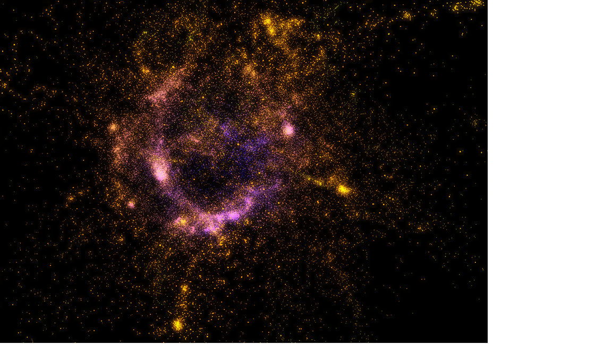

# N-body simulation

## Overview





## Table of contents
- [About this project](#about-this-project)  
- [Controls](#controls)  
- [How to run the project](#how-to-run-the-project)  
- [Program arguments](#program-arguments)  
- [Available versions](#available-versions)  
- [Available initializations](#available-initializations)  
- [Program structure](#program-structure)

## About this project  
This project was made to learn `C++`, `OpenGL` and `GPU programming`.

### Features
- Different versions/algorithms can be tried.
- Different initializations can be tried.
- The number of bodies to simulate can be customized.
- The simulation is in a 3D world.
- Particles have bloom.
- Leapfrog integrator.
- Plummer softening.
- Customizable step size and squared softening.

## Controls
| Key/Input      | Action                                   |
|----------------|------------------------------------------|
| Esc            | Close the program                        |
| Space          | Pause/start the simulation               |
| Mouse scroll   | Zoom in/out                              |
| Click and drag | Move the camera                          |
| B              | Activate/Deactivate bloom                |
| I              | Increase bloom intensity                 |
| D              | Decrease bloom intensity                 |
| Q              | Enable/disable point size                |
| S              | Save the current state of the simulation |

  

## How to run the project

1. [Linux](#linux)
2. [Windows](#windows)

### Linux

#### Previous requirements
You need to have installed:
- `git`
- `xorg-dev`
- `cmake`
- `make`

#### Run the program 
This command will create a new directory titled `build` and change the location to it.
```bash
mkdir build && cd build
``` 
Build a `Makefile` using `cmake`.
```bash
cmake ..
```
Compile the program using the `Makefile`.
```bash
make
```
Run the compiled program.
```bash
./N-body
```

### Windows
#### Previous requirements
- `git`
- `cmake`
- `mingw`

Since the program uses OpenMP, you also need to install this:
```commandline
mingw-get install mingw32-pthreads-w32
```
#### Run the program
These commands will create a new directory titled `build` and change the location to it.
```bash
mkdir build 
cd build
``` 
Build a `Makefile` using `cmake`.
```bash
cmake -G "MinGW Makefiles" ..
```
Compile the program using the `Makefile`.
```bash
 mingw32-make
```

Run the compiled program.
```bash
.\N-body.exe  
```

## Program arguments
- `-v (number)` Configure which [version](#available-versions) you want to use. 
- `-i (number)` Configure which [initialization](#available-initializations) you want (How the bodies are initialized).
- `-n (number)` Configure how many bodies you want to simulate. 
- `-t (decimalNumber)` Configure the step size. (Smaller the more precise)
- `-s (decimalNumber)` Configure the squared softening. 
- `-f (path/to/file)` Provide a [particle system file](#particle-system-file).
- `-o (customFileName)` [Save the simulation](#save-simulations).

The default arguments are:
```bash
./N-body -v 1 -i 2 -n 100 -t 0.0035 -s 40.0
```
Alternative usage:
```bash
./N-body -version 1 -init 2 -n 100 -time-step 0.0035 -softening 40.0
```

## Available Versions

These are the available versions you can try:

| Version | Description                                                                                                                                                                                                                                       | Time Complexity                                                   |
|---------|---------------------------------------------------------------------------------------------------------------------------------------------------------------------------------------------------------------------------------------------------|-------------------------------------------------------------------|
| `-v 1`  | Naïve particle-particle interaction computed sequentially on the CPU. Every particle interacts with every other particle directly.                                                                                                                | O(n^2)                                                            |
| `-v 2`  | Parallelized version of `-v 1` using OpenMP for CPU multithreading, improving performance.                                                                                                                            | O(n^2)                                                            |
| `-v 3`  | GPU-accelerated particle-particle interaction using compute shaders. Leverages massive parallelism but still follows a brute-force approach.                                                                                                      | O(n^2)                                                            |
| `-v 4`  | Optimized version of `-v 3` based on [NVIDIA’s Fast N-body Simulation](https://developer.nvidia.com/gpugems/gpugems3/part-v-physics-simulation/chapter-31-fast-n-body-simulation-cuda), reducing memory bottlenecks and improving GPU efficiency. | O(n^2)                                                            |
| `-v 5`  | Fixed grid algorithm for spatial partitioning, allowing more efficient force calculations by limiting interactions to nearby particles.                                                                                                           | This version can be further improved and has mistakes to be fixed |
| `-v 6`  | Iterative, stackless Octree Barnes-Hut algorithm computed sequentially on the CPU. Approximates distant particle groups as single bodies to reduce complexity.                                                                                    | O(n log n)                                                        |
| `-v 7`  | Hybrid version of `-v 6`. The octree is built sequentially on the CPU, but force calculations and particle updates are parallelized using CPU multithreading.                                                                                     | O(n log n)                                                        |
| `-v 8`  | Hybrid approach: octree construction remains sequential on the CPU, while force computation and particle updates are offloaded to the GPU for parallel execution.                                                                                 | O(n log n)                                                        |

## Available initializations
You can try the next initializations:
- `-i 1` Particles form a cube.
- `-i 2` Particles form a disk.
- `-i 3` Particles form an equilateral triangle. (Only 3 particles)
- `-i 4` Particles form a sphere. (Only the surface)
- `-i 5` Particles form a ball.
- `-i 6` Particles form a cube. (Only the surface)

## Particle system file
The files you give to the program must follow this format:
```html
Particle System with 3 particles:
Particle ID: 0
Position: (5.8337, 4.6008, 3.35599)
Velocity: (-1.15428, 1.8317, 0)
Acceleration: (0, 0, 0)
Mass: 0.625
Particle ID: 1
Position: (2.13544, 2.37607, 3.12727)
Velocity: (1.01254, -1.94254, 0)
Acceleration: (0.4, 3.0, 0)
Mass: 0.875
Particle ID: 2
Position: (2.74389, 2.46503, 3.42229)
Velocity: (0.0960527, 2.17343, 0)
Acceleration: (0, 0, -8.0)
Mass: 0.875
Particle ID: 3
Position: (3.38766, 0.977181, 2.78489)
Velocity: (1.10174, 2.40912, 0)
Acceleration: (-8.0, 0, 0)
Mass: 0.625
```
> Note: The world dimensions are (5, 5, 5)

This is how you can use the `-f` argument:
````bash
./N-body -f path/to/file
````

### Save simulations 
The program offers the ability to save various states of the simulation. It includes the following features:

1. Saving the initial state: The program automatically saves the initial state at the start of the simulation.
2. Saving the current state: By pressing the "S" key during the simulation, you can save the current state for later analysis.
3. Saving the final state: At the end of the simulation, the program saves the final state.

The saved states are stored in files located in the compiled directory of the program. To save the states, you need to provide a filename using the `-output` or `-o` argument when running the program.

These saving functionalities allow capturing different moments of the simulation for further analysis and study.


## Benchmark
There's a benchmark (written in Python) available for measuring the performance of each version, which generates different plots for comparison. If you're interested, please read the readme file inside the `benchmark` directory.

## Program structure
Here you can see the class diagram. It should be relativley easy to add new initializations and versions.  


An example of how a new simulation version can be added is by creating a new class that implements the `ParticleSolver` interface and then including the new version in the list of available version options in the `ArgumentsParser` class. This way, the user can select the new version through the input arguments.   

Similarly, to add a new initialization, a new class that implements the `ParticleSystemInitializer` interface can be created and the new option can be added to the list of initialization options in the `ArgumentsParser` class.   

Finally, you would have to use the new initalization or version you created in `main.cpp`.


